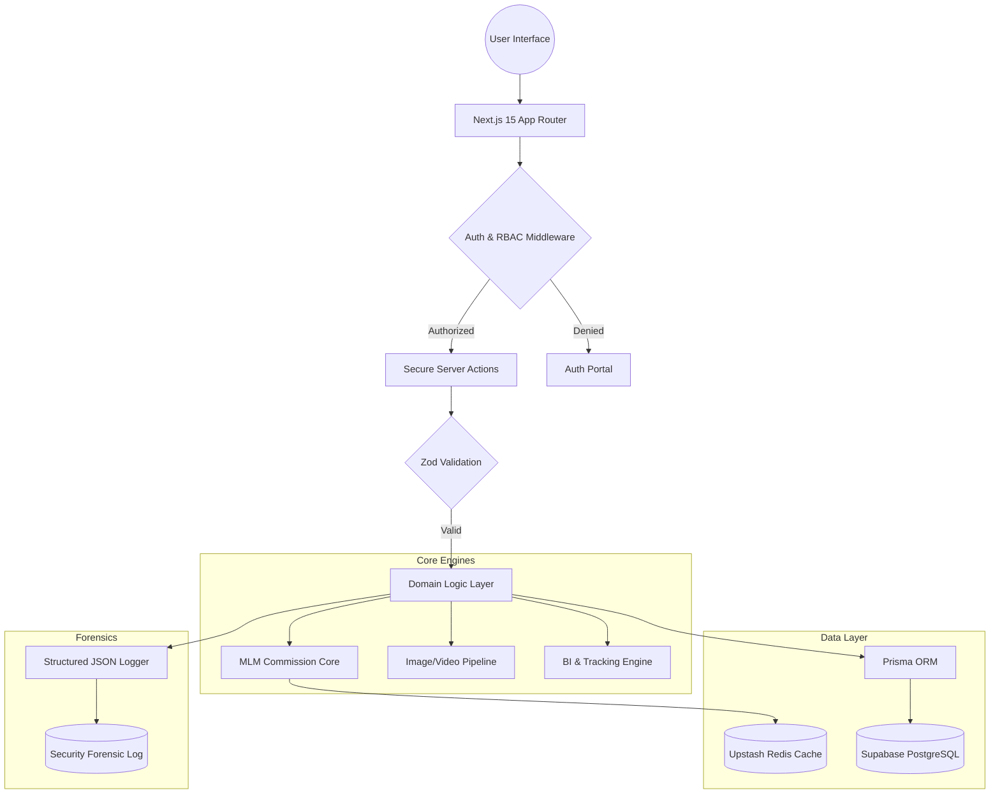
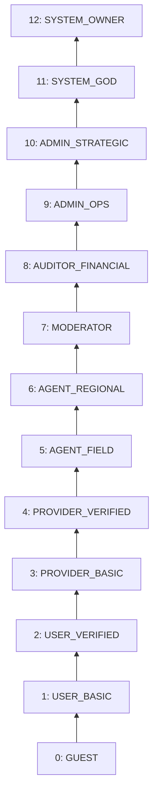
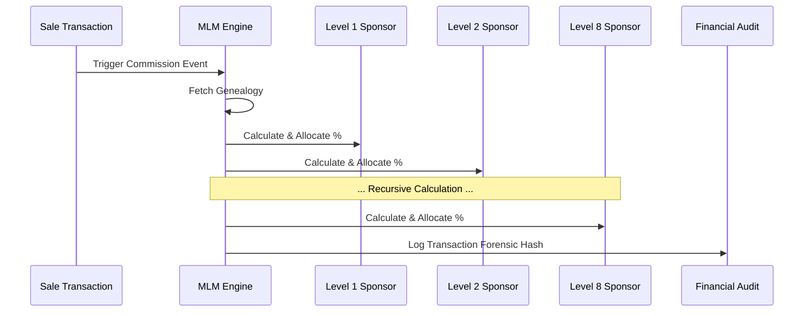

# 🏛️ SaidonClub Architecture — Omega OS Blueprint
> **The Engineering behind the Global MLM & Marketplace Revolution.**

## 📐 Design Philosophy
SaidonClub OS is built on the principles of **Domain-Driven Design (DDD)**, **Monorepo Efficiency**, and **Forensic Observability**. Every architectural decision is made to ensure that the system can scale from 1,000 to 1,000,000 users without architectural regression.

---

## 🗺️ Data & Logic Flow

---

## 🛡️ RBAC Hierarchy (12-Level)

---

## ⛓️ MLM Commission Cascade (8-Level)

---

## 🧩 Monorepo Modules

### 1. Unified Web App (`apps/web`)
The heartbeat of the system.
- **Next.js 15:** Utilizing Server Components for heavy data fetching and Client Components for interactive dashboards.
- **Server Actions:** Secure, type-safe endpoints for all mutations.
- **Shared State:** Optimized React Contexts for UI, Auth, and Marketplace state.

### 2. MLM Financial Engine (`packages/mlm-engine`)
The core mathematical brain.
- **Cascade Algorithm:** Calculates 8 levels of commissions in O(n) time.
- **Genealogy Management:** High-performance tree traversal for network visualization.
- **Rank Evaluation:** Event-driven rank upgrades triggered by volume milestones.

### 3. Security & RBAC (`packages/rbac`)
Ironclad access control.
- **12-Level Hierarchy:** From `GUEST` to `SYSTEM_OWNER`.
- **Permission-Based:** Access is granted via specific permission keys, allowing for highly granular control.

### 4. Database Core (`packages/database`)
The source of truth.
- **Prisma Schema:** Centralized type definitions and migrations.
- **Seed System:** Deterministic data seeding for staging and testing environments.

### 5. Media Pipeline (`packages/media-engine`)
- **Sharp Optimization:** Automatic WebP/AVIF conversion.
- **Cloud Storage:** Secure integration with Supabase Storage buckets.

---

## 🛡️ Forensic Security Protocol
1.  **Strict Runtime Validation:** Zod ensures no malformed data reaches the database.
2.  **Omega Structured Logging:** Every mutation is logged with its context, user ID, and timestamp in a searchable JSON format.
3.  **RBAC Guards:** Every Server Action is wrapped in a `withRole` or `withPermission` higher-order function.
4.  **Transaction Integrity:** All financial operations (Wallet, Commissions) use ACID transactions to prevent data inconsistency.

---

## 🚀 Deployment Infrastructure
- **Hosting:** Vercel (Next.js Edge Runtime).
- **Backend-as-a-Service:** Supabase (Auth, DB, Storage).
- **In-Memory Store:** Upstash Redis (Rate limiting & MLM Caching).
- **DNS & CDN:** Cloudflare (WAF & DDoS Protection).

---

*Architectural Blueprint v5.4.0 — Engineered by Antigravity AI.*